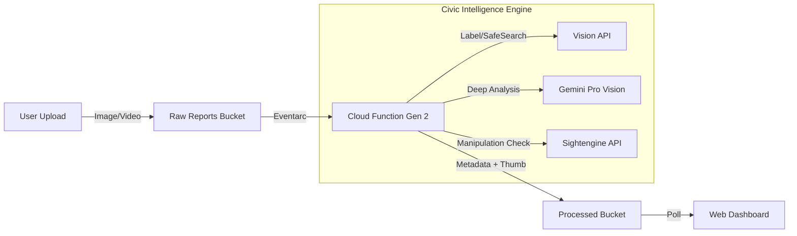

# Civic Intelligence Engine

> **A cloud-native, event-driven pipeline that uses AI to automate civic issue verification and triage.**

Citizens upload photos or videos of civic issues (potholes, broken street lights, illegal dumping). Instead of manual review, the system **automatically classifies, moderates, and optimizes** every report using **Google Cloud Vision AI**, **Gemini Pro**, and **Sightengine** — all triggered serverlessly the instant a file lands in Cloud Storage.

---

## 🚀 Key Features

- **📸 Multi-Modal Analysis**: Processes both **Images** and **Videos**.
- **🧠 Civic Intelligence**: Uses **Gemini Pro Vision** to understand the context, severity, and urgency of incidents.
- **🤖 Authenticity Verification**: Detects AI-generated content (Deepfakes) using a hybrid check (Gemini Forensics + Sightengine).
- **🏷️ Auto-Tagging**: Google Cloud Vision AI for object detection and labeling.
- **🛡️ Content Moderation**: Automatically flags inappropriate or unsafe content.
- **📊 Live Dashboard**: A local FastAPI webapp to visualize uploads and analysis results in real-time.

---

## 🧱 Architecture



## 📂 Project Structure

```
vision/
├── main.tf                        # Terraform – all GCP resources
├── variables.tf                   # Configurable inputs
├── function_source/               # Cloud Function Code
│   ├── main.py                    # Entry-point
│   ├── civic_intelligence.py      # AI Analysis Logic
│   ├── detectors.py               # Authenticity Checks
│   └── prompt_templates.py        # Gemini Prompts
└── webapp/                        # Local Dashboard
    ├── app.py                     # FastAPI Backend
    └── static/                    # Frontend Assets
```

---

## ⚙️ What Gets Provisioned (Terraform)

| Resource | Purpose |
|----------|---------|
| **Vision API** | Label detection + SafeSearch moderation |
| **Vertex AI API** | Access to Gemini Pro models |
| **Cloud Functions (Gen 2)** | Serverless processing pipeline |
| **Eventarc** | GCS triggers for the function |
| **Storage Buckets** | `raw-reports` (Input) & `processed-thumbnails` (Output) |

---

## 🧠 What the Cloud Function Does

1. **Ingests** uploaded images or videos.
2. **Authenticity Check**: Verifies if the content is real or AI-generated using distinct forensic layers.
3. **Vision AI Analysis**: Detects objects and flags unsafe content (SafeSearch).
4. **Civic Intelligence**:
    - **Incident Type**: Classifies the issue (e.g., "Infrastructure", "Sanitation").
    - **Severity**: Scores the severity (1-10) with justification.
    - **Urgency**: Determines if immediate action is needed.
5. **Generates Output**: Saves a processed thumbnail and attaches the full **Civic Reports** as metadata.

---

## 🚀 Deployment

### Prerequisites to Deploy
- [Terraform ≥ 1.5](https://developer.hashicorp.com/terraform/downloads)
- Google Cloud Project with Billing Enabled

### 1. Configure
```bash
cp terraform.tfvars.example terraform.tfvars
# Update terraform.tfvars with your Project ID and secrets
```

### 2. Deploy Infrastructure
```bash
terraform init
terraform apply
```

### 3. Run Dashboard (Local)
```bash
cd webapp
python -m venv venv
.\venv\Scripts\activate
pip install -r requirements.txt
python app.py
# Open http://localhost:5000
```

---

## 📝 License

This project is part of the **Voice of the People** civic technology initiative.
